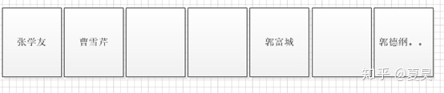
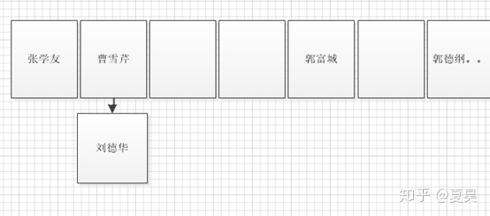

# HashMap

## **HashMap的节点**

HashMap是一个集合，键值对的集合,源码中每个节点用Node<K,V>表示

```java
static class Node<K,V> implements Map.Entry<K,V> {
   final int hash;
   final K key;
   V value;
   Node<K,V> next;
```

Node是一个内部类，这里的key为键，value为值，next指向下一个元素，可以看出HashMap中的元素不是一个单纯的键值对，**还包含下一个元素的引用**。

## **HashMap的数据结构**

HashMap的数据结构为 **数组+(链表或红黑树)**

**数组的特点：查询效率高，插入，删除效率低**。

**链表的特点：查询效率低，插入删除效率高**。

在HashMap底层使用数组加（链表或红黑树）的结构完美的解决了数组和链表的问题，使得查询和插入，删除的效率都很高。

## **HashMap存储元素的过程**

通过hashcode值和数组长度取模我们可以得到元素存储的下标。

刘德华的hashcode为20977295 数组长度为 16则要存储在数组索引为 20977295%16=1的地方



可以分两种情况:

\1. 数组索引为1的地方是空的，这种情况很简单，直接将元素放进去就好了。

\2. 已经有元素占据了索引为1的位置，这种情况下我们需要判断一下该位置的元素和当前元素是否相等，使用equals来比较。

如果使用默认的规则是比较两个对象的地址。也就是两者需要是同一个对象才相等，当然我们也可以重写equals方法来实现我们自己的比较规则最常见的是通过比较属性值来判断是否相等。

**如果两者相等则直接覆盖**，**如果不等则在原元素下面使用链表的结构存储该元素**



每个元素节点都有一个next属性指向下一个节点，这里由数组结构变成了数组+链表结构,红黑树又是怎么回事呢？

因为链表中元素太多的时候会影响查找效率，所以当链表的元素个数达到8的时候使用链表存储就转变成了使用红黑树存储，原因就是**红黑树是平衡二叉树，在查找性能方面比链表要高**.