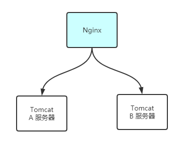

# 分布式锁

## 技术背景

为什么需要分布式锁?

1. 内存级锁以及分布式锁

> 内存级锁即我们在 Java 中的 synchronized 关键字（或许加上进程级锁修饰更恰当些），而分布式锁则是应用在分布式系统中的一种锁机制

首先我们按需设计方案

- 系统是单机还是分布式?

单机使用内存锁, 锁住方法.

- 系统使用mysql还是可以使用redis 

使用mysql: 

实现:

1. 表增加唯一索引
2. 加锁：执行insert语句，若报错，则表明加锁失败
3. 解锁：执行delete语句

优缺点:

1. 完全利用DB现有能力，实现简单
2. 锁无超时自动失效机制，有死锁风险
3. 不支持锁重入，不支持阻塞等待
4. 操作数据库开销大，性能不高

使用redis:

实现:

1. 加锁：执行setnx，若成功再执行expire添加过期时间
2. 解锁：执行delete命令

优缺点:

1. 最轻,实现简单,性能最好

2. setnx和expire分2步执行，非原子操作；若setnx执行成功，但expire执行失败，就可能出现死锁
3. delete命令存在误删除非当前线程持有的锁的可能
4. 不支持阻塞等待、不可重入


我们接下来以一段简单的秒杀系统中的判断库存及减库存来描述下为什么需要到分布式锁：

```java
Copypublic String deductStock() throws InterruptedException {
    
    // 1.从 Redis 中获取库存值
    int stock = Integer.parseInt(stringRedisTemplate.opsForValue().get("stock"));
    // 2.判断库存
    if (stock > 0) {
        int readStock = stock - 1;
        // 3.从新设置库存
        stringRedisTemplate.opsForValue().set("stock", realStock + ""); 
        System.out.println("扣减成功，剩余库存：" + readStock + "");
    } else {
        System.out.println("扣减失败，库存不足");
    }
    
    return "end";
}
```

上面这段代码中，实现了电商系统中的一个简单小需求，即判断商品的剩余数量是否充足，充足则可以成功卖出商品，并将库存减去 1。我们很容易了解这段代码的目的。接下来我们就来一步一步地分析这段代码的缺陷。

## 基本实现[#](https://www.cnblogs.com/jojop/p/14008824.html#2730527930)

### 原子性问题[#](https://www.cnblogs.com/jojop/p/14008824.html#925537573)

上面代码中的注释1~3部分，并没有实现原子性的逻辑。所以假设现在如果只剩下一件商品，那么可能会出现以下情况：

- 线程 A 运行到代码2，判断库存大于0，进入条件体中将 `stock - 1` 赋值给 readStock，在执行代码 3 前停止了下来；
- 线程 B 同样运行到代码2，判断出库存大于0（线程A并没有写回Redis），之后并没有停止，而是继续执行到方法结束；
- 线程 A 此时恢复执行，执行完代码 3，将库存写回 Redis。

现在我们就发现了问题，明明只有一件商品，却被两个线程卖出去了两次，这就是没有保证这部分代码的原子性所带来的安全问题。

那对于这个问题如何解决呢？

常规的方式自然就是加锁以保证并发安全。那么以我们 Java 自带的锁去保证并发安全，如下：

```java
Copypublic Synchronized String deductStock() throws InterruptedException {    
    // 业务逻辑...
}
```

我们知道 synchronized 和 Lock 支持 JVM 内同一进程内的线程互斥，所以如果我们的项目是单机部署的话，到这里也就能保证这段代码的原子性了。不过以互联网项目来说，为了避免单点故障以及并发量的问题，一般都是以分布式的形式部署的，很少会以单机部署，这种情况就会带来新的问题。

### 分布式问题[#](https://www.cnblogs.com/jojop/p/14008824.html#434767127)

刚刚我们将到了如果项目分布式部署的话，那么就会产生新的并发问题。接下来我们以 Nginx 配置负载均衡为例来演示并发问题，同样的请求可能会被分发到多台服务器上，那么我们刚刚所讲的 synchronized 或者 Lock 在此时就失效了。同样的代码，在 A 服务器上确实可以避免其他线程去竞争资源，但是此时 A 服务器上的那段 synchronized 修饰的方法并不能限制 B 服务器上的程序去访问那段代码，所以依旧会产生我们一开始所讲到的线程并发问题。

[](https://img2020.cnblogs.com/blog/1614350/202011/1614350-20201120002833860-2019224698.png)

那么如何解决掉这个问题呢？这个是否就需要 Redis 上场了，Redis 中有一个命令`SETNX key value`，`SETNX` 是 “SET if not exists” （如果不存在，则 SET）的缩写。那么这条指令只在 `key` 不存在的情况下，将键 `key` 的值设置为 `value`。若键 `key` 已经存在，则 `SETNX` 命令不做任何动作。

有了上面命令做支撑，同时我们了解到 Redis 是单线程模型（不要去计较它的网络读写和备份状态下的多线程）。那么我们就可以这么实现，当一个服务器成功的向 Redis 中设置了该命令，那么就认定为该服务器获得了当前的分布式锁，而其他服务器此时就只能一直等待该服务器释放了锁为止。我们来看下代码实现：

```java
Copy// 为了演示方便，这里简单定义了一个常量作为商品的id
public static final String PRODUCT_ID = "100001";

public String deductStock() throws InterruptedException {

    // 通过 stringRedisTemplate 来调用 Redis 的 SETNX 命令，key 为商品的id，value的值在这不重要
    Boolean result = stringRedisTemplate.opsForValue().setIfAbsent(RODUCT_ID, "jojo");
    if (!result) {
        return "error";
    }

    int stock = Integer.parseInt(stringRedisTemplate.opsForValue().get("stock"));
    if (stock > 0) {
        int readStock = stock - 1;
        stringRedisTemplate.opsForValue().set("stock", realStock + ""); 
        System.out.println("扣减成功，剩余库存：" + readStock + "");
    } else {
        System.out.println("扣减失败，库存不足");
    }

    // 业务执行完成，删除PRODUCT_ID key
    stringRedisTemplate.delete(PRODUCT_ID);
    
    return "end";
}
```

到这里我们就成功地利用 Redis 实现了一把简单的分布式锁，那么这样实现是否就没有问题了呢？

### 锁释放问题[#](https://www.cnblogs.com/jojop/p/14008824.html#4137841691)

生产环境比我们想象中要复杂得多，上面代码并不能正真地运用在我们的生产环境中，我们可以试想一下，如果服务器 A 中的程序成功地给线程加锁，并且执行完了减库存的逻辑，但是最终却没有安全地运行`stringRedisTemplate.delete(PRODUCT_ID)`这行代码，也就是没有成功释放锁，那其他服务器就永远无法拿到 Redis 中的分布式锁了，也就会陷入死锁的状态。

解决这个方法，可能许多人都会想到想到——`try-finally`语句块，像下面代码这样：

```java
Copypublic String deductStock() throws InterruptedException {

    Boolean result = stringRedisTemplate.opsForValue().setIfAbsent(RODUCT_ID, "jojo");
    if (!result) {
        return "error";
    }

    try {
        int stock = Integer.parseInt(stringRedisTemplate.opsForValue().get("stock"));
        if (stock > 0) {
            int readStock = stock - 1;
            stringRedisTemplate.opsForValue().set("stock", realStock + ""); 
            System.out.println("扣减成功，剩余库存：" + readStock + "");
        } else {
            System.out.println("扣减失败，库存不足");
        }
    } finally {
        //业务执行完成，删除PRODUCT_ID key
        stringRedisTemplate.delete(PRODUCT_ID);
    }

    return "end";
}
```

但是上面代码是否正真解决问题了呢？单看代码本身是没什么问题的，但是前面提到，生产环境是非常复杂的。我们假设这种情况：当线程在成功加锁之后，执行业务代码时，还没来得及删除 Redis 中的锁标志，此时，这台服务器宕机了，程序并没有想我们想象中地去执行 finally 块中的代码。这种情况也会使得其他服务器或者进程在后续过程中无法去获取到锁，从而导致死锁，最终导致业务崩溃的情况。所以说，对于锁释放问题来说，`try-finally` 语句块在这里还不够，那么我们就需要新的方法来解决这个问题了。

### Redis 超时机制[#](https://www.cnblogs.com/jojop/p/14008824.html#1808575570)

Redis 中允许我们设置缓存的自动过期时间，我们可以将其引入我们上面的锁机制中，这样就算 finally 语句块中的释放语句没有被正确执行，Redis 中的缓存也能在设定时间内自动过期，不会形成死锁：

```java
Copy// 设置过期时间
stringRedisTemplate.expire(lockKey, 10, TimeUnit.SECONDS);
```

当然如果只是简单的在代码中加入上述语句的话，还是有可能产生死锁的，因为加锁以及设置过期时间是分开来执行的，并不能保证原子性。所以为了解决这个问题，Redis 中也提供了将设置值与设置过期时间合一的操作，对于 Java 代码如下：

```java
Copy// 将设置值与设置过期时间合一
stringRedisTemplate.opsForValue().opsForValue().setIfAbsent(lockKey, "jojo", 10, TimeUnit.SECONDS);
```

到这一步，我们可以确保 Redis 中我们上的锁，最终无论如何都能成功地被释放掉，避免了造成死锁的情况。但是以当前的代码实现来看，在一些高并发场景下还是可能产生锁失效的情况。我们可以试想一下，上面代码我们设置的过期时间为 10s，那么如果这个进程在 10s 内并没有完成这段业务逻辑，会产生什么样的情况？不过在此之前我们先将代码的公共部分抽出作一个组件类，这样有助于我们关注锁的逻辑。

## 代码集成[#](https://www.cnblogs.com/jojop/p/14008824.html#3929455145)

### 公共方法的提取[#](https://www.cnblogs.com/jojop/p/14008824.html#252625283)

我们这里先定义一个 `RedisLock` 接口，代码如下所示：

```java
Copypublic interface RedisLock {
    /**
     * 尝试加锁
     */
    boolean tryLock(String key, long timeout, TimeUnit unit);
    
    /**
     * 解锁操作
     */
    void releaseLock(String key);
    
}
```

接下来，我们基于上面已经实现的分布式锁的思路，来实现这个接口，代码如果所示：

```java
Copypublic class RedisLockImpl implements RedisLock {
    
    @Autowired
    private StringRedisTemplate stringRedisTemplate;
    
    @Override
    public boolean tryLock(String key, long timeout, TimeUnit unit) {
        return stringRedisTemplate.opsForValue().setIfAbsent(key, "jojo", timeout, unit);
    }
    
    @Override
    public void releaseLock(String key) {
        stringRedisTemplate.delete(key);
    }
    
}
```

### 加锁&解锁的归一化[#](https://www.cnblogs.com/jojop/p/14008824.html#1646042562)

我们先来继续分析上面代码。从开发的角度来说，当一个线程从上到下执行一个需要加分布式锁的业务时，它首先需要进行加锁操作，当业务执行完毕后，再进行释放锁的操作。也就是先调用 `tryLock()` 函数再调用 `releaseLock()` 函数。

但是真正可靠代码并不依靠人性，其他开发人员有可能在编写代码的时候并没有调用 `tryLock()` 方法，而是直接调用了 `releaseLock()` 方法，并且可能在调用 `releaseLock()` 时传入的 Key 值与你调用 `tryLock()` 时传入的 Key 值是相同的，那么此时就可能出现问题：另一段代码在运行时，硬生生将你代码中加的锁给释放掉了，那么此时的锁就失效了。所以上述代码依旧是有不可靠的地方，锁的可能误删操作会使得程序存在很严重的问题。

那么针对这一问题，我们就需要实现加锁&解锁的归一化。

首先我们解释一下什么叫做加锁和解锁的归一化，简单来说，就是一个线程执行了加锁操作后，后续的解锁操作只能由该线程来执行，即加锁操作和解锁只能由同一线程来进行。

这里我们使用 ThreadLocal 和 UUID 来实现，代码如下：

```java
Copypublic class RedisLockImpl implements RedisLock {
    
    @Autowired
    private StringRedisTemplate stringRedisTemplate;
    
    private ThreadLock<string> threadLock = new ThreadLock<>();
    
    @Override
    public boolean tryLock(String key, long timeout, TimeUnit unit) {
        String uuid = UUID.randomUUID().toString();
        threadlocal.set(uuid);
        return stringRedisTemplate.opsForValue().setIfAbsent(key, uuid, timeout, unit);
    }
    
    @Override
    public void releaseLock(String key) {
        if (threadLocal.get().equals(stringRedisTemplate.opsForValue().get(key))) {
            stringRedisTemplate.delete(key);
        }
    }
    
}
```

> https://www.cnblogs.com/jojop/p/14008824.html

