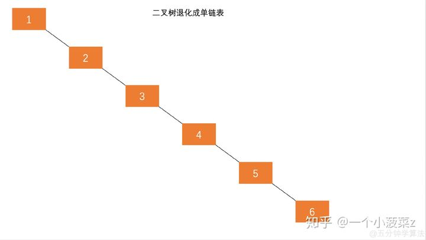
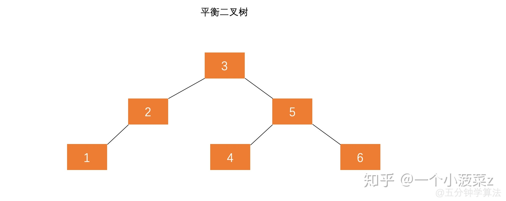
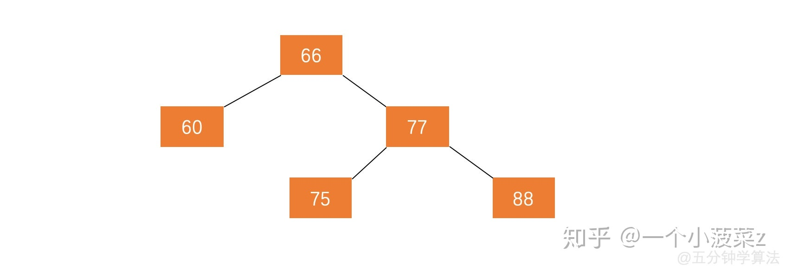
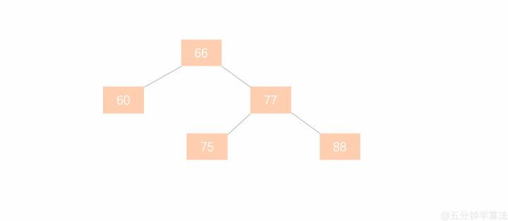
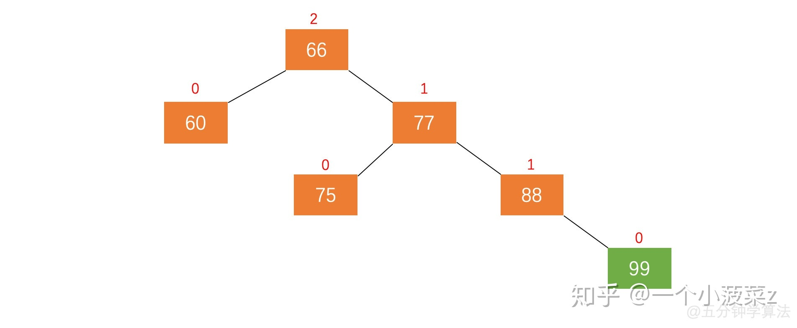
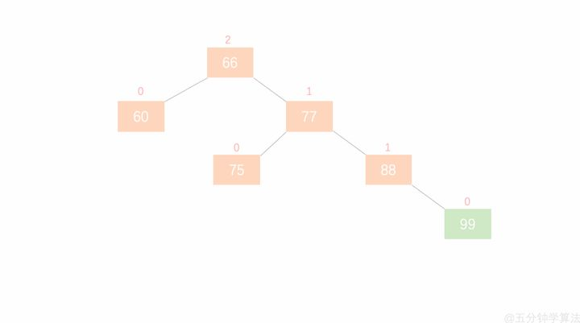
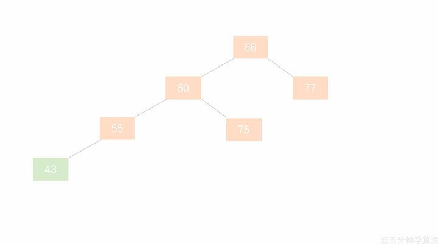

# 平衡二叉树（AVL）

## 为什么要有平衡二叉树

二叉搜索树一定程度上可以提高搜索效率，但是当原序列有序时，例如序列 A = {1，2，3，4，5，6}，构造二叉搜索树如图 1.1。依据此序列构造的二叉搜索树为右斜树，同时二叉树退化成单链表，搜索效率降低为 O(n)。





在此二叉搜索树中查找元素 6 需要查找 6 次。

二叉搜索树的查找效率取决于树的高度，因此保持树的高度最小，即可保证树的查找效率。同样的序列 A，将其改为图 1.2 的方式存储，查找元素 6 时只需比较 3 次，查找效率提升一倍。





可以看出当节点数目一定，保持树的左右两端保持平衡，树的查找效率最高。

**这种左右子树的高度相差不超过 1 的树为平衡二叉树。**

## 定义

**平衡二叉查找树**：简称平衡二叉树。由前苏联的数学家 **A**delse-**V**elskil 和 **L**andis 在 1962 年提出的高度平衡的二叉树，根据科学家的英文名也称为 AVL 树。它具有如下几个性质：

1. 可以是空树。
2. 假如不是空树，任何一个结点的左子树与右子树都是平衡二叉树，并且高度之差的绝对值不超过 1。

## 平衡因子

**定义：**某节点的左子树与右子树的高度(深度)差即为该节点的平衡因子（BF,Balance Factor），平衡二叉树中不存在平衡因子大于 1 的节点。在一棵平衡二叉树中，节点的平衡因子只能取 0 、1 或者 -1 ，分别对应着左右子树等高，左子树比较高，右子树比较高。

## 节点结构

定义平衡二叉树的节点结构：

```cpp
typedef struct AVLNode *Tree;

typedef int ElementType;

struct AVLNode{

    int depth; //深度，这里计算每个结点的深度，通过深度的比较可得出是否平衡

    Tree parent; //该结点的父节点

    ElementType val; //结点值

    Tree lchild;

    Tree rchild;

    AVLNode(int val=0) {
        parent = NULL;
        depth = 0;
        lchild = rchild = NULL;
        this->val=val;
    }
};
```

## AVL树插入时的失衡与调整

图 5.1 是一颗平衡二叉树





在此平衡二叉树插入节点 99 ，树结构变为：





在动图 5.2 中，节点 66 的左子树高度为 1，右子树高度为 3，此时平衡因子为 -2，树失去平衡。

在动图 5.2 中，以节点 66 为父节点的那颗树就称为 **最小失衡子树**。

**最小失衡子树**：在新插入的结点向上查找，以第一个平衡因子的**绝对值**超过 1 的结点为根的子树称为最小不平衡子树。也就是说，一棵失衡的树，是有可能有多棵子树同时失衡的。而这个时候，我们只要调整最小的不平衡子树，就能够将不平衡的树调整为平衡的树。

**平衡二叉树的失衡调整主要是通过旋转最小失衡子树来实现的**。根据旋转的方向有两种处理方式，**左旋** 与 **右旋** 。

旋转的目的就是减少高度，通过降低整棵树的高度来平衡。哪边的树高，就把那边的树向上旋转。

### 左旋





以图 5.1.1 为例，加入新节点 99 后， 节点 66 的左子树高度为 1，右子树高度为 3，此时平衡因子为 -2。为保证树的平衡，此时需要对节点 66 做出旋转，因为右子树高度高于左子树，对节点进行左旋操作，流程如下：

（1）节点的右孩子替代此节点位置 （2）右孩子的左子树变为该节点的右子树 （3）节点本身变为右孩子的左子树

整个操作流程如动图 5.1.2 所示。





- 节点的右孩子替代此节点位置 —— 节点 66 的右孩子是节点 77 ，将节点 77 代替节点 66 的位置
- 右孩子的左子树变为该节点的右子树 —— 节点 77 的左子树为节点 75，将节点 75 挪到节点 66 的右子树位置
- 节点本身变为右孩子的左子树 —— 节点 66 变为了节点 77 的左子树

### 右旋

右旋操作与左旋类似，操作流程为：

（1）节点的左孩子代表此节点 （2）节点的左孩子的右子树变为节点的左子树 （3）将此节点作为左孩子节点的右子树。




## 小总结

1. 在所有的不平衡情况中，都是按照先 **寻找最小不平衡树**，然后 **寻找所属的不平衡类别**，再 **根据 4 种类别进行固定化程序的操作**。
